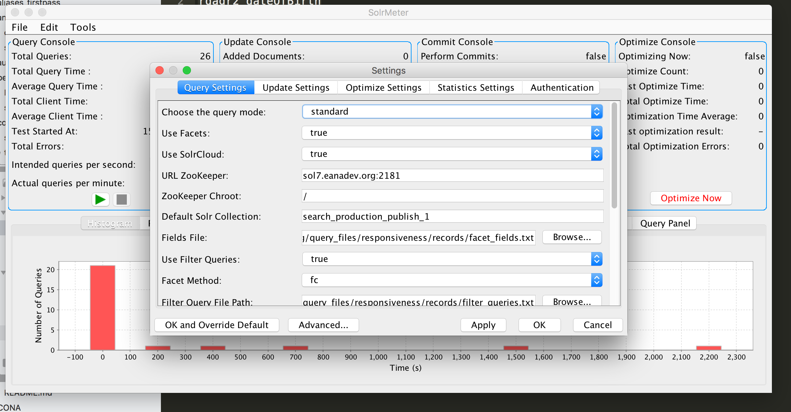

# Testing Europeana Solr Deployments

This directory contains the application (SolrMeter) and query files necessary for basic testing and sanity-checking of Europeana Solr deployments. 

Note that the testing referred to here is purely functional: determining that Solr _contents_ are correct and as expected is a different (and for the moment mostly manual) task. Using SolrMeter it is possible simply to determine whether Solr is available, whether it responds to queries without throwing errors, and how responsive it is.

## SolrMeter

The version of SolrMeter used here is the [application](https://github.com/idealista/solrmeter) extended by [idealista](https://github.com/idealista) to accommodate SolrCloud.

Running SolrMeter is easy - simply:

`cd solrmeter/target`

and then:

`java -jar solrmeter-0.4.1-SNAPSHOT-jar-with-dependencies.jar`

Configuring SolrMeter for testing a given deployment is done through the `Edit > Settings` panel. The panel itself should be reasonably self-explanatory; settings for particular Solr deployments are given in the README.md document of the appropriate `query_files` subdirectory.

A screenshot of the settings panel is provided below:

